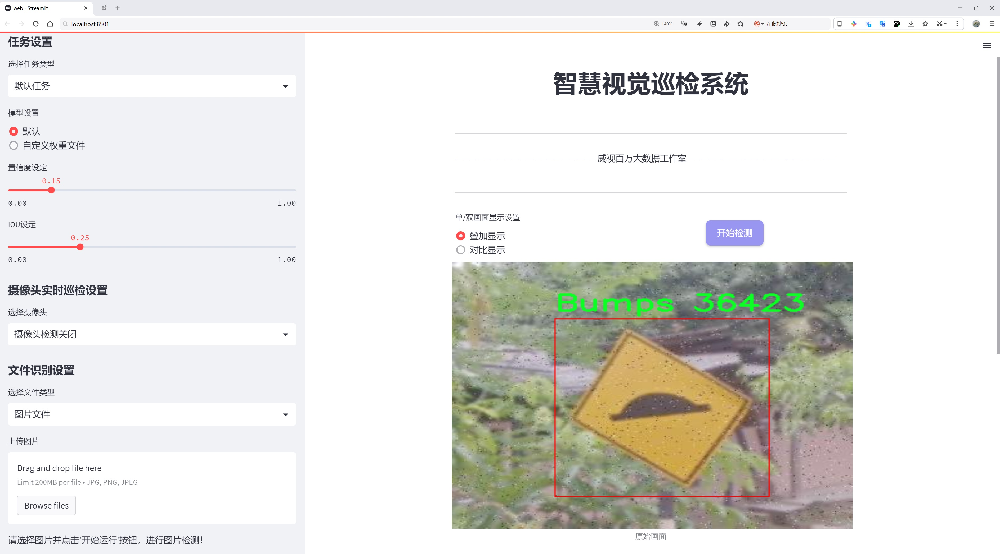
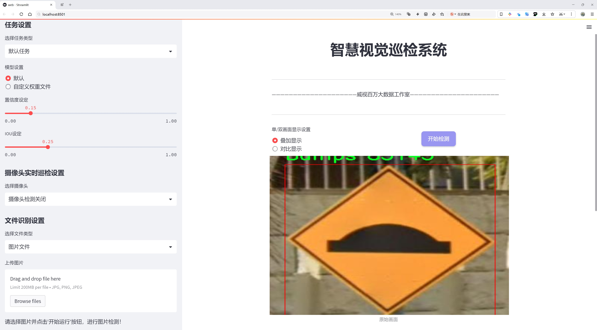
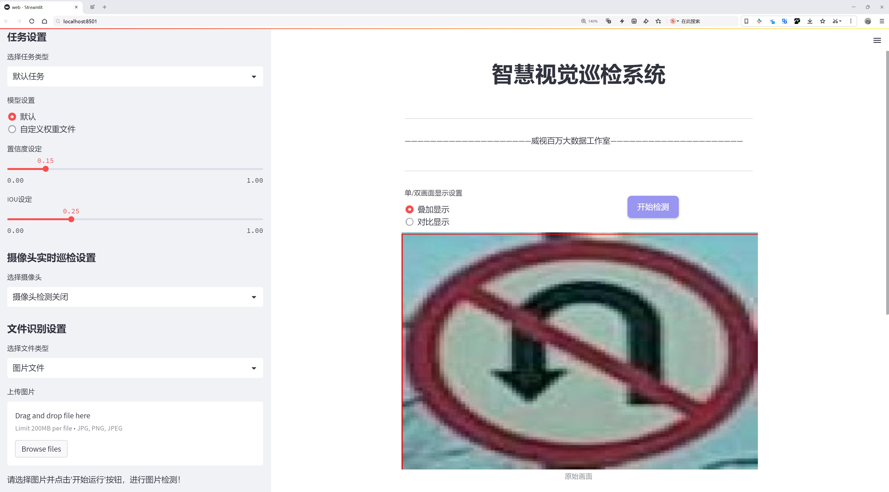
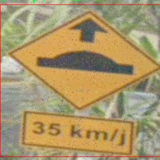
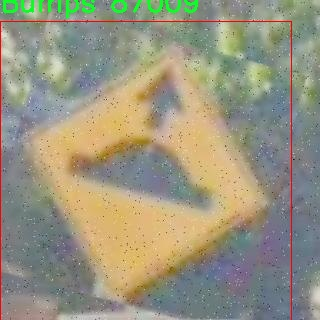

# 交通标志与路面标识检测检测系统源码分享
 # [一条龙教学YOLOV8标注好的数据集一键训练_70+全套改进创新点发刊_Web前端展示]

### 1.研究背景与意义

项目参考[AAAI Association for the Advancement of Artificial Intelligence](https://gitee.com/qunmasj/projects)

项目来源[AACV Association for the Advancement of Computer Vision](https://kdocs.cn/l/cszuIiCKVNis)

研究背景与意义

随着城市化进程的加快，交通管理的复杂性不断增加，交通安全问题日益突出。交通标志与路面标识作为道路交通管理的重要组成部分，承担着引导和规范驾驶行为的关键作用。然而，传统的交通标志识别方法往往依赖于人工检测，效率低下且容易受到环境因素的影响，难以满足现代智能交通系统的需求。因此，基于计算机视觉和深度学习技术的自动化检测系统应运而生，成为提升交通安全和管理效率的重要手段。

YOLO（You Only Look Once）系列模型因其高效的实时目标检测能力而受到广泛关注。YOLOv8作为该系列的最新版本，进一步优化了检测精度和速度，适用于复杂的交通场景。通过改进YOLOv8模型，我们可以构建一个高效的交通标志与路面标识检测系统，旨在提高交通标志的识别率和响应速度，从而为智能交通系统的建设提供技术支持。

本研究所使用的数据集“TrafficCombine”包含1900张图像，涵盖了6类交通标志与路面标识，包括减速带、斑马线、禁止掉头、限速、停车标志和交通信号灯。这些标志在城市交通中具有重要的指示和警示作用，准确的检测和识别能够有效减少交通事故的发生。通过对这些标志的自动检测，不仅可以提高交通管理的智能化水平，还能为自动驾驶技术的发展提供数据支持。

在实际应用中，交通标志的种类繁多且环境复杂，光照变化、遮挡、污损等因素都会影响标志的可见性和识别率。因此，改进YOLOv8模型的研究意义在于提升其在各种复杂场景下的鲁棒性和适应性。通过引入数据增强、模型集成等技术手段，我们可以有效提高模型的泛化能力，使其在不同的环境条件下依然能够保持高效的检测性能。

此外，随着人工智能技术的不断发展，交通标志与路面标识的自动检测系统不仅可以应用于传统的交通管理，还可以与智能交通信号控制、车联网等技术相结合，形成一个综合的智能交通解决方案。这将为城市交通的智能化、信息化发展提供新的思路和方向。

综上所述，基于改进YOLOv8的交通标志与路面标识检测系统的研究，不仅具有重要的理论意义，也具有广泛的应用前景。通过提高交通标志的检测效率和准确性，我们可以为提升交通安全、优化交通管理提供有力的技术支持，推动智能交通系统的进一步发展。

### 2.图片演示







##### 注意：由于此博客编辑较早，上面“2.图片演示”和“3.视频演示”展示的系统图片或者视频可能为老版本，新版本在老版本的基础上升级如下：（实际效果以升级的新版本为准）

  （1）适配了YOLOV8的“目标检测”模型和“实例分割”模型，通过加载相应的权重（.pt）文件即可自适应加载模型。

  （2）支持“图片识别”、“视频识别”、“摄像头实时识别”三种识别模式。

  （3）支持“图片识别”、“视频识别”、“摄像头实时识别”三种识别结果保存导出，解决手动导出（容易卡顿出现爆内存）存在的问题，识别完自动保存结果并导出到tempDir中。

  （4）支持Web前端系统中的标题、背景图等自定义修改，后面提供修改教程。

  另外本项目提供训练的数据集和训练教程,暂不提供权重文件（best.pt）,需要您按照教程进行训练后实现图片演示和Web前端界面演示的效果。

### 3.视频演示

[3.1 视频演示](https://www.bilibili.com/video/BV1ucxLeUEJR/)

### 4.数据集信息展示

##### 4.1 本项目数据集详细数据（类别数＆类别名）

nc: 6
names: ['Bumps', 'Crosswalk', 'No-Uturn', 'Speedlimit', 'Stop', 'Trafficlight']


##### 4.2 本项目数据集信息介绍

数据集信息展示

在现代智能交通系统的研究与应用中，交通标志与路面标识的准确检测是确保道路安全和提高交通效率的关键因素之一。为此，我们构建了一个名为“TrafficCombine”的数据集，旨在为改进YOLOv8的交通标志与路面标识检测系统提供高质量的训练数据。该数据集包含六个主要类别，分别是“Bumps”（减速带）、“Crosswalk”（人行横道）、“No-Uturn”（禁止掉头）、“Speedlimit”（限速标志）、“Stop”（停车标志）和“Trafficlight”（交通信号灯）。这些类别的选择不仅涵盖了交通标志与路面标识的多样性，还考虑到了不同交通场景下的实际应用需求。

“TrafficCombine”数据集的构建过程经过精心设计，确保了数据的多样性和代表性。我们从多个城市和地区收集了大量的交通标志与路面标识图像，涵盖了不同的天气条件、光照变化和交通环境。这种多样性使得数据集能够更好地模拟现实世界中的复杂情况，从而提高YOLOv8模型在实际应用中的鲁棒性和准确性。每个类别的图像都经过严格的标注，确保每个标志的边界框和类别标签的准确性，为模型的训练提供了可靠的基础。

在数据集的规模方面，“TrafficCombine”不仅包含丰富的图像数量，还确保了每个类别的样本均衡分布。这种均衡性有助于避免模型在训练过程中对某些类别的偏倚，提高了模型对所有类别的识别能力。为了进一步增强数据集的实用性，我们还对图像进行了多种数据增强处理，包括旋转、缩放、裁剪和颜色变换等。这些增强手段不仅增加了数据集的多样性，还提高了模型的泛化能力，使其能够在不同的场景中保持良好的性能。

在实际应用中，交通标志与路面标识的检测不仅需要高准确率，还要求快速响应，以适应实时交通管理的需求。因此，我们在设计“TrafficCombine”数据集时，特别关注了标志的清晰度和可辨识性。所有图像均经过精心挑选，确保标志在各种环境下都能被清晰识别。通过这种方式，我们希望能够为YOLOv8模型的训练提供一个高质量的基础，使其在实际应用中能够快速、准确地识别交通标志与路面标识。

总之，“TrafficCombine”数据集的构建不仅是为了提升YOLOv8模型的性能，更是为了推动智能交通系统的发展。通过提供一个全面、均衡且高质量的数据集，我们期望能够为未来的交通管理和安全提供更为强大的技术支持。随着交通标志与路面标识检测技术的不断进步，我们相信这一数据集将为研究人员和工程师们提供宝贵的资源，助力他们在智能交通领域的探索与创新。







### 5.全套项目环境部署视频教程（零基础手把手教学）

[5.1 环境部署教程链接（零基础手把手教学）](https://www.ixigua.com/7404473917358506534?logTag=c807d0cbc21c0ef59de5)


[5.2 安装Python虚拟环境创建和依赖库安装视频教程链接（零基础手把手教学）](https://www.ixigua.com/7404474678003106304?logTag=1f1041108cd1f708b01a)

### 6.手把手YOLOV8训练视频教程（零基础小白有手就能学会）

[6.1 手把手YOLOV8训练视频教程（零基础小白有手就能学会）](https://www.ixigua.com/7404477157818401292?logTag=d31a2dfd1983c9668658)

### 7.70+种全套YOLOV8创新点代码加载调参视频教程（一键加载写好的改进模型的配置文件）

[7.1 70+种全套YOLOV8创新点代码加载调参视频教程（一键加载写好的改进模型的配置文件）](https://www.ixigua.com/7404478314661806627?logTag=29066f8288e3f4eea3a4)

### 8.70+种全套YOLOV8创新点原理讲解（非科班也可以轻松写刊发刊，V10版本正在科研待更新）

由于篇幅限制，每个创新点的具体原理讲解就不一一展开，具体见下列网址中的创新点对应子项目的技术原理博客网址【Blog】：


[8.1 70+种全套YOLOV8创新点原理讲解链接](https://gitee.com/qunmasj/good)

### 9.系统功能展示（检测对象为举例，实际内容以本项目数据集为准）

图9.1.系统支持检测结果表格显示

  图9.2.系统支持置信度和IOU阈值手动调节

  图9.3.系统支持自定义加载权重文件best.pt(需要你通过步骤5中训练获得)

  图9.4.系统支持摄像头实时识别

  图9.5.系统支持图片识别

  图9.6.系统支持视频识别

  图9.7.系统支持识别结果文件自动保存

  图9.8.系统支持Excel导出检测结果数据


### 10.原始YOLOV8算法原理

原始YOLOv8算法原理

YOLOv8是2023年1月由Ultralytics发布的一款先进的目标检测模型，标志着YOLO系列算法的又一次重要进化。该算法的设计灵感源自于之前的多个版本，包括YOLOX、YOLOv6、YOLOv7以及PPYOLOE等，通过整合这些前沿技术，YOLOv8在目标检测的精度和速度上达到了新的高度，展现出其在实时检测领域的巨大潜力。

YOLOv8的架构主要由输入层、主干网络（Backbone）、特征融合层（Neck）和检测头（Head）组成。其输入层负责接收处理后的图像数据，主干网络则负责特征提取，特征融合层用于多尺度特征的整合，而检测头则将融合后的特征转化为最终的检测结果。与以往的YOLO系列相比，YOLOv8在各个模块的设计上都进行了创新和优化，尤其是在Backbone和Head部分的结构上，体现了更高的灵活性和适应性。

在Backbone部分，YOLOv8延续了YOLOv5的CSPDarknet设计理念，但将原有的C3模块替换为C2f模块。C2f模块的设计灵感来源于YOLOv7的ELAN结构，通过引入更多的残差连接，使得网络在保持轻量化的同时，能够获得更丰富的梯度信息。这种设计不仅提升了特征提取的能力，还有效缓解了深层网络中的梯度消失问题，从而提高了模型的收敛速度和检测精度。

YOLOv8在特征融合层采用了PAN-FPN结构，这一结构的设计旨在充分融合不同层次的特征信息，以便更好地进行目标检测。PAN-FPN结构通过自下而上的方式将高层特征与中层、浅层特征进行融合，同时在自上而下的过程中，确保每一层的特征图都能保留适当的分辨率和语义信息。这种特征融合的策略使得YOLOv8在处理多尺度目标时，能够更为精准地识别和定位。

在检测头部分，YOLOv8采用了当前流行的解耦合头结构，将分类和回归任务分开处理。通过引入Anchor-Free的思想，YOLOv8摒弃了传统的Anchor-Based方法，减少了对先验框的依赖，从而提高了模型的灵活性和适应性。此外，YOLOv8在损失函数的设计上也进行了创新，采用了BCELoss作为分类损失，并结合DFLLoss和CIoULoss作为回归损失。这种多损失函数的组合，有助于提升模型在复杂场景下的检测性能。

在训练过程中，YOLOv8引入了动态的Task-Aligned Assigner样本分配策略，并在数据增强方面采用了多种技术，包括马赛克增强、混合增强、空间扰动和颜色扰动等。这些数据增强手段不仅提高了模型的鲁棒性，还有效地扩展了训练样本的多样性，使得模型在面对不同场景时，能够保持较高的检测精度。

值得一提的是，YOLOv8在处理小目标时表现尤为突出，这得益于其采用的Focal Loss损失函数。Focal Loss通过调整样本的权重，特别是对难以分类的小目标样本，增强了模型对这些样本的学习能力。这一设计有效解决了训练过程中正负样本不平衡的问题，使得YOLOv8在实际应用中能够更好地应对各种复杂的检测任务。

总的来说，YOLOv8通过对主干网络、特征融合层和检测头的创新设计，结合先进的损失函数和数据增强策略，形成了一种高效、精准的目标检测解决方案。其在苹果采摘等农业自动化领域的应用，展示了YOLOv8在实际场景中的强大能力，标志着目标检测技术在智能农业中的广泛应用前景。随着YOLOv8的不断发展和优化，未来的目标检测任务将更加高效和智能化，为各行各业带来更大的便利和效益。


### 11.项目核心源码讲解（再也不用担心看不懂代码逻辑）

#### 11.1 code\ultralytics\utils\callbacks\base.py

以下是经过精简和注释的核心代码部分，主要保留了回调函数和默认回调字典的定义。

```python
# Ultralytics YOLO 🚀, AGPL-3.0 license
"""基础回调函数定义。"""

from collections import defaultdict
from copy import deepcopy

# 训练回调函数 ----------------------------------------------------------------------------------------------------

def on_train_start(trainer):
    """训练开始时调用的回调函数。"""
    pass

def on_train_epoch_start(trainer):
    """每个训练周期开始时调用的回调函数。"""
    pass

def on_train_batch_start(trainer):
    """每个训练批次开始时调用的回调函数。"""
    pass

def on_train_batch_end(trainer):
    """每个训练批次结束时调用的回调函数。"""
    pass

def on_train_epoch_end(trainer):
    """每个训练周期结束时调用的回调函数。"""
    pass

def on_train_end(trainer):
    """训练结束时调用的回调函数。"""
    pass

# 验证器回调函数 --------------------------------------------------------------------------------------------------

def on_val_start(validator):
    """验证开始时调用的回调函数。"""
    pass

def on_val_batch_end(validator):
    """每个验证批次结束时调用的回调函数。"""
    pass

def on_val_end(validator):
    """验证结束时调用的回调函数。"""
    pass

# 预测器回调函数 --------------------------------------------------------------------------------------------------

def on_predict_start(predictor):
    """预测开始时调用的回调函数。"""
    pass

def on_predict_batch_end(predictor):
    """每个预测批次结束时调用的回调函数。"""
    pass

def on_predict_end(predictor):
    """预测结束时调用的回调函数。"""
    pass

# 导出器回调函数 ---------------------------------------------------------------------------------------------------

def on_export_start(exporter):
    """模型导出开始时调用的回调函数。"""
    pass

def on_export_end(exporter):
    """模型导出结束时调用的回调函数。"""
    pass

# 默认回调字典，包含所有的回调函数。用于在训练、验证、预测和导出过程中调用相应的回调。
default_callbacks = {
    "on_train_start": [on_train_start],
    "on_train_epoch_start": [on_train_epoch_start],
    "on_train_batch_start": [on_train_batch_start],
    "on_train_batch_end": [on_train_batch_end],
    "on_train_epoch_end": [on_train_epoch_end],
    "on_train_end": [on_train_end],
    "on_val_start": [on_val_start],
    "on_val_batch_end": [on_val_batch_end],
    "on_val_end": [on_val_end],
    "on_predict_start": [on_predict_start],
    "on_predict_batch_end": [on_predict_batch_end],
    "on_predict_end": [on_predict_end],
    "on_export_start": [on_export_start],
    "on_export_end": [on_export_end],
}

def get_default_callbacks():
    """
    返回一个默认回调字典的副本，字典的值为默认空列表。

    返回:
        (defaultdict): 一个带有默认空列表的defaultdict，键来自default_callbacks。
    """
    return defaultdict(list, deepcopy(default_callbacks))
```

### 代码说明：
1. **回调函数**：定义了一系列的回调函数，这些函数在训练、验证、预测和导出过程中被调用。每个函数目前都只是一个占位符，实际的逻辑需要在具体实现中填充。
  
2. **默认回调字典**：`default_callbacks`字典用于存储不同阶段的回调函数，便于在相应的训练、验证、预测和导出过程中调用。

3. **获取默认回调函数**：`get_default_callbacks`函数返回一个默认回调字典的副本，确保在使用时不会修改原始字典。

这些核心部分构成了回调机制的基础，允许在训练和推理过程中灵活地插入自定义逻辑。

这个文件是一个用于Ultralytics YOLO框架的回调函数模块，主要定义了一系列在训练、验证、预测和导出过程中可以调用的回调函数。回调函数是一种设计模式，允许在特定事件发生时执行自定义代码。文件中包含的回调函数主要用于在不同阶段执行特定操作，比如在训练开始、结束时，或者在每个批次的开始和结束时。

文件开头引入了`defaultdict`和`deepcopy`，这两个模块分别用于创建一个带有默认值的字典和深拷贝对象。接下来，文件中定义了一系列的回调函数，这些函数的主体目前都是空的，表示在特定事件发生时可以插入自定义逻辑。

在训练阶段，定义的回调函数包括：
- `on_pretrain_routine_start`和`on_pretrain_routine_end`：在预训练开始和结束时调用。
- `on_train_start`：训练开始时调用。
- `on_train_epoch_start`和`on_train_epoch_end`：每个训练周期开始和结束时调用。
- `on_train_batch_start`和`on_train_batch_end`：每个训练批次开始和结束时调用。
- `optimizer_step`：优化器更新参数时调用。
- `on_before_zero_grad`：在梯度归零之前调用。
- `on_fit_epoch_end`：在每个训练和验证周期结束时调用。
- `on_model_save`：模型保存时调用。
- `on_train_end`：训练结束时调用。
- `on_params_update`：模型参数更新时调用。
- `teardown`：训练过程结束时的清理工作。

在验证阶段，定义的回调函数包括：
- `on_val_start`、`on_val_batch_start`、`on_val_batch_end`和`on_val_end`：分别在验证开始、每个验证批次开始、结束时调用，以及验证结束时调用。

在预测阶段，定义的回调函数包括：
- `on_predict_start`、`on_predict_batch_start`、`on_predict_batch_end`、`on_predict_postprocess_end`和`on_predict_end`：分别在预测开始、每个预测批次开始、结束时调用，以及预测后处理结束和预测结束时调用。

在导出阶段，定义的回调函数包括：
- `on_export_start`和`on_export_end`：在模型导出开始和结束时调用。

接下来，文件定义了一个`default_callbacks`字典，将所有的回调函数按类别组织起来，以便于管理和调用。这个字典的键是回调函数的名称，值是包含相应回调函数的列表。

`get_default_callbacks`函数返回一个深拷贝的`default_callbacks`字典，确保每次调用时都能得到一个新的字典实例。

`add_integration_callbacks`函数用于将来自不同来源的集成回调添加到实例的回调字典中。它首先加载HUB回调，然后根据实例的类型（如Trainer、Predictor等）加载相应的回调，并将它们添加到实例的回调字典中。这种设计使得用户可以方便地扩展和集成其他回调功能，以满足特定需求。

总的来说，这个文件为Ultralytics YOLO框架提供了一个灵活的回调机制，允许用户在训练、验证、预测和导出过程中插入自定义逻辑，以便于监控和控制模型的训练过程。

#### 11.2 ui.py

```python
import sys
import subprocess

def run_script(script_path):
    """
    使用当前 Python 环境运行指定的脚本。

    Args:
        script_path (str): 要运行的脚本路径

    Returns:
        None
    """
    # 获取当前 Python 解释器的路径
    python_path = sys.executable

    # 构建运行命令，使用 streamlit 运行指定的脚本
    command = f'"{python_path}" -m streamlit run "{script_path}"'

    # 执行命令并等待其完成
    result = subprocess.run(command, shell=True)
    
    # 检查命令执行的返回码，如果不为0则表示出错
    if result.returncode != 0:
        print("脚本运行出错。")


# 主程序入口
if __name__ == "__main__":
    # 指定要运行的脚本路径
    script_path = "web.py"  # 假设脚本在当前目录下

    # 调用函数运行脚本
    run_script(script_path)
```

### 代码注释说明：
1. **导入模块**：
   - `sys`：用于获取当前 Python 解释器的路径。
   - `subprocess`：用于执行外部命令。

2. **定义 `run_script` 函数**：
   - 接收一个参数 `script_path`，表示要运行的 Python 脚本的路径。
   - 使用 `sys.executable` 获取当前 Python 解释器的路径。
   - 构建一个命令字符串，用于通过 `streamlit` 运行指定的脚本。
   - 使用 `subprocess.run` 执行构建的命令，并等待其完成。
   - 检查命令的返回码，如果返回码不为0，表示脚本运行出错，打印错误信息。

3. **主程序入口**：
   - 在 `if __name__ == "__main__":` 块中，指定要运行的脚本路径（这里假设为 `web.py`）。
   - 调用 `run_script` 函数，传入脚本路径以执行该脚本。

这个程序文件的主要功能是通过当前的 Python 环境来运行一个指定的脚本，具体是使用 Streamlit 框架来启动一个 Web 应用。首先，程序导入了必要的模块，包括 `sys`、`os` 和 `subprocess`，其中 `sys` 用于获取当前 Python 解释器的信息，`subprocess` 用于执行外部命令。

在 `run_script` 函数中，首先获取当前 Python 解释器的路径，这样可以确保使用正确的 Python 环境来运行脚本。接着，构建一个命令字符串，这个命令会调用 Streamlit 来运行指定的脚本。命令的格式是 `python -m streamlit run "script_path"`，其中 `script_path` 是要运行的脚本的路径。

然后，使用 `subprocess.run` 方法来执行这个命令，`shell=True` 参数允许在 shell 中执行命令。执行后，程序会检查返回的状态码，如果返回码不为零，表示脚本运行出错，程序会输出一条错误信息。

在文件的最后部分，使用 `if __name__ == "__main__":` 来确保只有在直接运行该文件时才会执行后面的代码。这里指定了要运行的脚本路径为 `web.py`，并调用 `run_script` 函数来启动这个脚本。

总的来说，这个程序是一个简单的脚本启动器，旨在方便地通过当前 Python 环境运行一个 Streamlit 应用。

#### 11.3 code\ultralytics\data\augment.py

以下是经过简化和注释的核心代码部分，主要包括图像增强的基础类和一些具体的增强实现：

```python
import random
import numpy as np
import cv2

class BaseTransform:
    """
    图像变换的基础类，提供了一些通用的图像处理方法。
    """

    def __init__(self) -> None:
        """初始化基础变换对象。"""
        pass

    def apply_image(self, labels):
        """应用图像变换到标签。"""
        pass

    def apply_instances(self, labels):
        """应用变换到标签中的物体实例。"""
        pass

    def apply_semantic(self, labels):
        """应用语义分割到图像。"""
        pass

    def __call__(self, labels):
        """应用所有标签变换到图像、实例和语义掩码。"""
        self.apply_image(labels)
        self.apply_instances(labels)
        self.apply_semantic(labels)


class Compose:
    """
    组合多个图像变换的类。
    """

    def __init__(self, transforms):
        """初始化组合对象，接受一个变换列表。"""
        self.transforms = transforms

    def __call__(self, data):
        """依次应用变换到输入数据。"""
        for t in self.transforms:
            data = t(data)
        return data


class Mosaic(BaseTransform):
    """
    马赛克增强，通过将多个图像组合成一个马赛克图像来进行增强。
    """

    def __init__(self, dataset, imgsz=640, p=1.0, n=4):
        """初始化马赛克对象，设置数据集、图像大小、概率和网格大小。"""
        assert 0 <= p <= 1.0, f"概率应在[0, 1]范围内，但得到{p}。"
        assert n in (4, 9), "网格大小必须为4或9。"
        self.dataset = dataset
        self.imgsz = imgsz
        self.p = p
        self.n = n

    def get_indexes(self):
        """从数据集中随机选择索引。"""
        return random.sample(range(len(self.dataset)), self.n - 1)

    def _mix_transform(self, labels):
        """应用马赛克增强到标签字典。"""
        mix_labels = [self.dataset[i] for i in self.get_indexes()]
        # 进行马赛克合成
        return self._mosaic4(labels, mix_labels)  # 假设使用4图像的马赛克

    def _mosaic4(self, labels, mix_labels):
        """创建一个2x2的马赛克图像。"""
        mosaic_img = np.full((self.imgsz * 2, self.imgsz * 2, 3), 114, dtype=np.uint8)  # 创建基础图像
        # 将4个图像放置到马赛克图像中
        for i, mix_label in enumerate(mix_labels):
            img = mix_label["img"]
            h, w = img.shape[:2]
            # 计算放置位置
            if i == 0:  # 左上
                mosaic_img[0:h, 0:w] = img
            elif i == 1:  # 右上
                mosaic_img[0:h, self.imgsz:self.imgsz + w] = img
            elif i == 2:  # 左下
                mosaic_img[self.imgsz:self.imgsz + h, 0:w] = img
            elif i == 3:  # 右下
                mosaic_img[self.imgsz:self.imgsz + h, self.imgsz:self.imgsz + w] = img
        labels["img"] = mosaic_img  # 更新标签中的图像
        return labels


class RandomFlip:
    """
    随机翻转图像的类，可以进行水平或垂直翻转。
    """

    def __init__(self, p=0.5, direction="horizontal"):
        """初始化随机翻转对象，设置翻转概率和方向。"""
        assert direction in ["horizontal", "vertical"], "支持的方向为'horizontal'或'vertical'。"
        self.p = p
        self.direction = direction

    def __call__(self, labels):
        """应用随机翻转到图像和实例。"""
        img = labels["img"]
        if random.random() < self.p:  # 根据概率决定是否翻转
            if self.direction == "horizontal":
                img = np.fliplr(img)  # 水平翻转
            elif self.direction == "vertical":
                img = np.flipud(img)  # 垂直翻转
        labels["img"] = img  # 更新标签中的图像
        return labels


# 示例使用
# dataset = ...  # 假设有一个数据集
# transforms = Compose([Mosaic(dataset), RandomFlip(p=0.5)])
# labels = {"img": image_data}  # 假设有图像数据
# transformed_labels = transforms(labels)  # 应用变换
```

### 代码说明：
1. **BaseTransform**: 定义了图像变换的基础类，包含了应用图像、实例和语义的基本方法。
2. **Compose**: 组合多个变换的方法，依次应用变换到输入数据。
3. **Mosaic**: 实现马赛克增强，通过将多个图像组合成一个图像来增强数据集。
4. **RandomFlip**: 随机翻转图像的实现，可以选择水平或垂直翻转。

这些类和方法构成了图像增强的基础，能够用于训练深度学习模型，提升模型的泛化能力。

这个程序文件 `augment.py` 是 Ultralytics YOLO 框架的一部分，主要用于图像增强和预处理。文件中定义了多个类和方法，旨在对输入图像及其标签进行各种变换，以提高模型的鲁棒性和泛化能力。

首先，文件导入了一些必要的库，包括数学运算、随机数生成、图像处理（OpenCV）、NumPy、PyTorch 及其相关模块。然后定义了一些常量，例如默认的均值和标准差，用于图像归一化。

接下来，定义了一个 `BaseTransform` 类，作为所有图像变换的基类。这个类包含了应用图像变换的方法，但具体的实现留给子类。`Compose` 类则用于将多个变换组合在一起，允许用户按顺序应用多个变换。

`BaseMixTransform` 类是用于混合增强（如 MixUp 和 Mosaic）的基类。它提供了基本的框架和方法来实现这些增强策略。`Mosaic` 类实现了马赛克增强，通过将多个图像组合成一个单一的图像来增加数据的多样性。`MixUp` 类则实现了 MixUp 增强，通过将两张图像按比例混合来生成新的图像。

`RandomPerspective` 类实现了随机透视变换，可以对图像进行旋转、平移、缩放和剪切等操作，同时更新对应的边界框、分割和关键点信息。`RandomHSV` 类则对图像的色调、饱和度和亮度进行随机调整，以增强色彩的多样性。

`RandomFlip` 类用于随机翻转图像，支持水平和垂直翻转，并相应地更新边界框和关键点。`LetterBox` 类则用于调整图像大小并填充边框，以适应目标检测和实例分割的要求。

`CopyPaste` 类实现了复制粘贴增强，能够将一个图像中的实例复制到另一个图像中，从而增加数据的多样性。`Albumentations` 类则提供了一系列额外的图像增强变换，使用了 Albumentations 库。

最后，文件中还定义了一些用于分类任务的变换函数，如 `classify_transforms` 和 `classify_augmentations`，这些函数为图像分类任务提供了必要的预处理和增强。

总体而言，这个文件通过定义多种图像增强和预处理的类和方法，为 YOLO 模型的训练提供了灵活的图像处理工具，旨在提高模型的性能和适应性。

#### 11.4 code\ultralytics\models\sam\modules\tiny_encoder.py

以下是经过简化并添加详细中文注释的核心代码部分：

```python
import torch
import torch.nn as nn
import torch.nn.functional as F

class Conv2d_BN(torch.nn.Sequential):
    """执行2D卷积并随后进行批量归一化的顺序容器。"""

    def __init__(self, in_channels, out_channels, kernel_size=1, stride=1, padding=0):
        """初始化卷积层和批量归一化层。"""
        super().__init__()
        # 添加卷积层
        self.add_module("conv", nn.Conv2d(in_channels, out_channels, kernel_size, stride, padding, bias=False))
        # 添加批量归一化层
        self.add_module("bn", nn.BatchNorm2d(out_channels))

class PatchEmbed(nn.Module):
    """将图像嵌入为补丁并投影到指定的嵌入维度。"""

    def __init__(self, in_chans, embed_dim, resolution, activation):
        """初始化补丁嵌入层。"""
        super().__init__()
        self.patches_resolution = (resolution // 4, resolution // 4)  # 计算补丁的分辨率
        self.seq = nn.Sequential(
            Conv2d_BN(in_chans, embed_dim // 2, kernel_size=3, stride=2, padding=1),
            activation(),
            Conv2d_BN(embed_dim // 2, embed_dim, kernel_size=3, stride=2, padding=1),
        )

    def forward(self, x):
        """通过补丁嵌入层的序列操作处理输入张量。"""
        return self.seq(x)

class MBConv(nn.Module):
    """移动反向瓶颈卷积层，EfficientNet架构的一部分。"""

    def __init__(self, in_chans, out_chans, expand_ratio, activation):
        """初始化MBConv层。"""
        super().__init__()
        self.conv1 = Conv2d_BN(in_chans, in_chans * expand_ratio, kernel_size=1)
        self.act1 = activation()
        self.conv2 = Conv2d_BN(in_chans * expand_ratio, in_chans * expand_ratio, kernel_size=3, padding=1, groups=in_chans * expand_ratio)
        self.act2 = activation()
        self.conv3 = Conv2d_BN(in_chans * expand_ratio, out_chans, kernel_size=1, bn_weight_init=0.0)
        self.act3 = activation()

    def forward(self, x):
        """实现MBConv层的前向传播。"""
        shortcut = x  # 残差连接
        x = self.conv1(x)
        x = self.act1(x)
        x = self.conv2(x)
        x = self.act2(x)
        x = self.conv3(x)
        x += shortcut  # 添加残差
        return self.act3(x)

class TinyViT(nn.Module):
    """TinyViT架构，用于视觉任务。"""

    def __init__(self, img_size=224, in_chans=3, num_classes=1000, embed_dims=[96, 192, 384, 768], depths=[2, 2, 6, 2]):
        """初始化TinyViT模型。"""
        super().__init__()
        self.patch_embed = PatchEmbed(in_chans=in_chans, embed_dim=embed_dims[0], resolution=img_size, activation=nn.GELU)
        self.layers = nn.ModuleList()
        for i_layer in range(len(depths)):
            layer = nn.ModuleList([MBConv(embed_dims[i_layer], embed_dims[i_layer], expand_ratio=4.0, activation=nn.GELU) for _ in range(depths[i_layer])])
            self.layers.append(layer)
        self.head = nn.Linear(embed_dims[-1], num_classes) if num_classes > 0 else nn.Identity()

    def forward(self, x):
        """执行前向传播。"""
        x = self.patch_embed(x)  # 输入为(N, C, H, W)
        for layer in self.layers:
            for block in layer:
                x = block(x)  # 通过每个MBConv块
        return self.head(x)  # 最终分类输出
```

### 代码说明：
1. **Conv2d_BN**: 这个类实现了一个包含卷积层和批量归一化层的顺序容器，方便构建卷积神经网络。
2. **PatchEmbed**: 该类将输入图像分割成补丁，并通过卷积层将其嵌入到指定的维度。
3. **MBConv**: 这是一个移动反向瓶颈卷积层，主要用于高效的特征提取，包含多个卷积和激活层。
4. **TinyViT**: 这是整个模型的核心类，负责构建TinyViT架构，包括补丁嵌入和多个MBConv层，最终输出分类结果。

通过这些核心组件，TinyViT能够有效地处理视觉任务。

这个程序文件定义了一个名为 `TinyViT` 的深度学习模型，主要用于计算机视觉任务。该模型是基于 Transformer 架构的，灵感来源于 LeViT 和 Swin Transformer，采用了一些创新的设计来提高性能和效率。

文件中首先导入了一些必要的库，包括 PyTorch 和相关的模块。接着定义了一些基础的组件类，例如 `Conv2d_BN`、`PatchEmbed`、`MBConv`、`PatchMerging`、`ConvLayer`、`Mlp`、`Attention`、`TinyViTBlock`、`BasicLayer`、`LayerNorm2d` 和最终的 `TinyViT` 类。

`Conv2d_BN` 类是一个顺序容器，执行二维卷积操作并紧接着进行批量归一化。`PatchEmbed` 类将输入图像嵌入为小块，并将其投影到指定的嵌入维度。`MBConv` 类实现了移动反向瓶颈卷积层，适用于高效的网络架构。`PatchMerging` 类则用于合并特征图中的相邻小块并投影到新的维度。

`ConvLayer` 类包含多个 MBConv 层，并支持输出的下采样和梯度检查点功能。`Mlp` 类实现了多层感知机，用于 Transformer 架构中的前馈网络。`Attention` 类实现了多头注意力机制，支持空间感知，能够根据空间分辨率应用注意力偏置。

`TinyViTBlock` 类是 TinyViT 的基本构建块，结合了自注意力和局部卷积操作。`BasicLayer` 类则是 TinyViT 中的一个基本层，包含多个 TinyViTBlock，并可选择性地进行下采样。

`LayerNorm2d` 类实现了二维的层归一化。最后，`TinyViT` 类是整个模型的核心，负责构建模型的各个层，包括图像嵌入、多个基本层、分类头等。它还实现了权重初始化和学习率衰减的功能。

在 `TinyViT` 的初始化中，用户可以指定输入图像的大小、输入通道数、分类类别数、嵌入维度、每层的深度、注意力头数、窗口大小等参数。这种灵活性使得模型可以根据具体任务进行调整。

总的来说，这个文件实现了一个高效的视觉 Transformer 模型，利用了多种现代深度学习技术，以便在计算机视觉任务中取得更好的性能。

#### 11.5 code\ultralytics\utils\metrics.py

以下是代码中最核心的部分，并附上详细的中文注释：

```python
import numpy as np
import torch

def box_iou(box1, box2, eps=1e-7):
    """
    计算两个边界框的交并比（IoU）。
    
    Args:
        box1 (torch.Tensor): 形状为 (N, 4) 的张量，表示 N 个边界框。
        box2 (torch.Tensor): 形状为 (M, 4) 的张量，表示 M 个边界框。
        eps (float, optional): 避免除以零的小值。默认为 1e-7。

    Returns:
        (torch.Tensor): 形状为 (N, M) 的张量，包含 box1 和 box2 中每对边界框的 IoU 值。
    """
    # 将 box1 和 box2 的坐标分开
    (a1, a2), (b1, b2) = box1.unsqueeze(1).chunk(2, 2), box2.unsqueeze(0).chunk(2, 2)
    
    # 计算交集区域
    inter = (torch.min(a2, b2) - torch.max(a1, b1)).clamp_(0).prod(2)

    # 计算 IoU = 交集 / (区域1 + 区域2 - 交集)
    return inter / ((a2 - a1).prod(2) + (b2 - b1).prod(2) - inter + eps)

def bbox_iou(box1, box2, xywh=True, eps=1e-7):
    """
    计算边界框的交并比（IoU）。
    
    Args:
        box1 (torch.Tensor): 形状为 (1, 4) 的张量，表示单个边界框。
        box2 (torch.Tensor): 形状为 (n, 4) 的张量，表示 n 个边界框。
        xywh (bool, optional): 如果为 True，输入框为 (x, y, w, h) 格式；如果为 False，输入框为 (x1, y1, x2, y2) 格式。默认为 True。
        eps (float, optional): 避免除以零的小值。默认为 1e-7。

    Returns:
        (torch.Tensor): IoU 值。
    """
    # 将 (x, y, w, h) 转换为 (x1, y1, x2, y2) 格式
    if xywh:
        (x1, y1, w1, h1), (x2, y2, w2, h2) = box1.chunk(4, -1), box2.chunk(4, -1)
        b1_x1, b1_x2, b1_y1, b1_y2 = x1 - w1 / 2, x1 + w1 / 2, y1 - h1 / 2, y1 + h1 / 2
        b2_x1, b2_x2, b2_y1, b2_y2 = x2 - w2 / 2, x2 + w2 / 2, y2 - h2 / 2, y2 + h2 / 2
    else:
        b1_x1, b1_y1, b1_x2, b1_y2 = box1.chunk(4, -1)
        b2_x1, b2_y1, b2_x2, b2_y2 = box2.chunk(4, -1)

    # 计算交集区域
    inter = (b1_x2.minimum(b2_x2) - b1_x1.maximum(b2_x1)).clamp_(0) * (
        b1_y2.minimum(b2_y2) - b1_y1.maximum(b2_y1)
    ).clamp_(0)

    # 计算并集区域
    union = (b1_x2 - b1_x1) * (b1_y2 - b1_y1 + eps) + (b2_x2 - b2_x1) * (b2_y2 - b2_y1 + eps) - inter + eps

    # 返回 IoU 值
    return inter / union

def compute_ap(recall, precision):
    """
    计算平均精度（AP）给定召回率和精度曲线。
    
    Args:
        recall (list): 召回率曲线。
        precision (list): 精度曲线。

    Returns:
        (float): 平均精度。
        (np.ndarray): 精度包络曲线。
        (np.ndarray): 修改后的召回率曲线。
    """
    # 在开始和结束处添加哨兵值
    mrec = np.concatenate(([0.0], recall, [1.0]))
    mpre = np.concatenate(([1.0], precision, [0.0]))

    # 计算精度包络
    mpre = np.flip(np.maximum.accumulate(np.flip(mpre)))

    # 计算曲线下面积
    x = np.linspace(0, 1, 101)  # 101 点插值
    ap = np.trapz(np.interp(x, mrec, mpre), x)  # 积分

    return ap, mpre, mrec
```

### 代码说明：
1. **box_iou**：计算两个边界框之间的交并比（IoU），输入为两个边界框的坐标，输出为它们的 IoU 值。
2. **bbox_iou**：计算单个边界框与多个边界框之间的 IoU，支持两种输入格式（xywh 和 xyxy）。
3. **compute_ap**：计算给定召回率和精度曲线的平均精度（AP），并返回 AP 值及相关曲线。

这些函数是目标检测评估中的核心部分，主要用于计算模型预测的准确性和性能。

这个程序文件是一个用于计算和更新模型验证指标的模块，主要用于目标检测和分类任务。文件中定义了多个函数和类，涵盖了不同的评估指标和计算方法。

首先，文件导入了一些必要的库，包括数学计算库、警告处理、路径处理、绘图库和深度学习框架PyTorch。接着，定义了一些常量和函数，例如计算边界框（bounding box）之间的交并比（IoU）和其他相关指标的函数。

在函数部分，`bbox_ioa`函数计算给定两个边界框的交集与第二个框的面积的比值，`box_iou`函数计算两个边界框之间的IoU，`bbox_iou`函数则提供了多种IoU计算方式，包括标准IoU、广义IoU（GIoU）、距离IoU（DIoU）和完整IoU（CIoU）。此外，还有用于计算掩膜IoU和关键点相似性（OKS）的函数。

接下来，定义了一个`ConfusionMatrix`类，用于计算和更新混淆矩阵。该类包含初始化方法和处理分类预测和检测结果的方法。它能够根据检测结果和真实标签更新混淆矩阵，并提供可视化功能。

在后续部分，定义了一些用于绘制精确度-召回率曲线、指标-置信度曲线的函数，以及计算平均精度（AP）和每个类别的AP的函数。`Metric`类用于计算YOLOv8模型的评估指标，包括精确度、召回率和平均精度等。

最后，文件中还定义了多个类，如`DetMetrics`、`SegmentMetrics`、`PoseMetrics`和`ClassifyMetrics`，这些类分别用于计算不同任务的指标，包括目标检测、分割、姿态估计和分类。每个类都包含处理预测结果的方法、计算平均值的方法、返回指标的字典等功能。

整体来看，这个模块为YOLO模型的评估提供了全面的支持，能够计算多种指标并生成相应的可视化结果，便于开发者分析模型性能。

#### 11.6 code\ultralytics\engine\model.py

以下是代码中最核心的部分，并附上详细的中文注释：

```python
class Model(nn.Module):
    """
    统一所有模型API的基础类。

    参数:
        model (str, Path): 要加载或创建的模型文件路径。
        task (Any, optional): YOLO模型的任务类型。默认为None。

    属性:
        predictor (Any): 预测器对象。
        model (Any): 模型对象。
        task (str): 模型任务类型。
        ckpt (Any): 如果模型是从*.pt文件加载的检查点对象。
        cfg (str): 如果从*.yaml文件加载的模型配置。
    """

    def __init__(self, model: Union[str, Path] = "yolov8n.pt", task=None, verbose=False) -> None:
        """
        初始化YOLO模型。

        参数:
            model (Union[str, Path], optional): 要加载或创建的模型路径或名称。默认为'yolov8n.pt'。
            task (Any, optional): YOLO模型的任务类型。默认为None。
            verbose (bool, optional): 是否启用详细模式。
        """
        super().__init__()
        self.predictor = None  # 预测器对象
        self.model = None  # 模型对象
        self.task = task  # 任务类型
        self.model_name = model = str(model).strip()  # 去除模型名称的空格

        # 检查是否为Ultralytics HUB模型
        if self.is_hub_model(model):
            self.session = self._get_hub_session(model)  # 获取HUB会话
            model = self.session.model_file  # 从HUB获取模型文件

        # 加载或创建新的YOLO模型
        model = checks.check_model_file_from_stem(model)  # 检查模型文件后缀
        if Path(model).suffix in (".yaml", ".yml"):
            self._new(model, task=task, verbose=verbose)  # 从配置文件创建新模型
        else:
            self._load(model, task=task)  # 从权重文件加载模型

        self.model_name = model  # 更新模型名称

    def predict(self, source=None, stream=False, predictor=None, **kwargs):
        """
        使用YOLO模型进行预测。

        参数:
            source (str | int | PIL | np.ndarray): 要进行预测的图像源。
            stream (bool): 是否流式传输预测结果。默认为False。
            predictor (BasePredictor): 自定义预测器。
            **kwargs : 传递给预测器的其他关键字参数。

        返回:
            (List[ultralytics.engine.results.Results]): 预测结果列表。
        """
        if source is None:
            source = ASSETS  # 如果没有提供源，则使用默认资产
            LOGGER.warning(f"WARNING ⚠️ 'source' is missing. Using 'source={source}'.")

        # 检查是否为命令行接口
        is_cli = (sys.argv[0].endswith("yolo") or sys.argv[0].endswith("ultralytics")) and any(
            x in sys.argv for x in ("predict", "track", "mode=predict", "mode=track")
        )

        custom = {"conf": 0.25, "save": is_cli}  # 方法默认参数
        args = {**self.overrides, **custom, **kwargs, "mode": "predict"}  # 合并参数
        if not self.predictor:
            self.predictor = predictor or self._smart_load("predictor")(overrides=args, _callbacks=self.callbacks)
            self.predictor.setup_model(model=self.model, verbose=is_cli)  # 设置模型
        return self.predictor.predict_cli(source=source) if is_cli else self.predictor(source=source, stream=stream)

    @staticmethod
    def is_hub_model(model):
        """检查提供的模型是否为HUB模型。"""
        return any(
            (
                model.startswith(f"{HUB_WEB_ROOT}/models/"),  # 检查是否为HUB模型URL
                [len(x) for x in model.split("_")] == [42, 20],  # 检查APIKEY_MODELID格式
                len(model) == 20 and not Path(model).exists() and all(x not in model for x in "./\\"),  # 检查MODELID格式
            )
        )

    def _load(self, weights: str, task=None):
        """
        从权重文件加载模型并推断任务类型。

        参数:
            weights (str): 要加载的模型检查点。
            task (str | None): 模型任务。
        """
        suffix = Path(weights).suffix
        if suffix == ".pt":
            self.model, self.ckpt = attempt_load_one_weight(weights)  # 加载权重
            self.task = self.model.args["task"]  # 获取任务类型
        else:
            weights = checks.check_file(weights)  # 检查文件
            self.model, self.ckpt = weights, None
            self.task = task or guess_model_task(weights)  # 推断任务类型
        self.overrides["model"] = weights  # 更新覆盖参数
        self.overrides["task"] = self.task  # 更新任务类型

    def _new(self, cfg: str, task=None, model=None, verbose=False):
        """
        从配置文件初始化新模型并推断任务类型。

        参数:
            cfg (str): 模型配置文件。
            task (str | None): 模型任务。
            model (BaseModel): 自定义模型。
            verbose (bool): 加载时显示模型信息。
        """
        cfg_dict = yaml_model_load(cfg)  # 加载yaml配置
        self.cfg = cfg
        self.task = task or guess_model_task(cfg_dict)  # 推断任务类型
        self.model = (model or self._smart_load("model"))(cfg_dict, verbose=verbose)  # 创建模型
        self.model.args = {**DEFAULT_CFG_DICT, **self.overrides}  # 合并默认参数和模型参数
        self.model.task = self.task  # 设置任务类型
```

### 主要功能概述
1. **模型初始化**：`__init__`方法用于初始化YOLO模型，支持从HUB加载模型、从权重文件加载模型或从配置文件创建新模型。
2. **预测功能**：`predict`方法用于执行预测，支持多种输入源，返回预测结果。
3. **模型加载**：`_load`和`_new`方法分别用于从权重文件和配置文件加载模型，推断任务类型。
4. **HUB模型检查**：`is_hub_model`方法用于检查给定的模型是否为HUB模型。

这个程序文件定义了一个名为 `Model` 的类，主要用于统一不同 YOLO 模型的 API。该类继承自 PyTorch 的 `nn.Module`，并提供了一系列方法和属性来加载、训练、预测和导出模型。

在初始化方法 `__init__` 中，用户可以指定模型的路径或名称、任务类型和是否启用详细模式。构造函数会检查模型是否来自 Ultralytics HUB 或 Triton Server，并根据文件后缀加载模型或创建新模型。如果模型是 YAML 配置文件，则调用 `_new` 方法进行初始化；如果是权重文件，则调用 `_load` 方法加载模型。

`__call__` 方法是对 `predict` 方法的别名，允许用户通过调用模型实例来进行预测。类中还定义了一些静态方法，如 `_get_hub_session` 用于创建 HUB 训练会话，`is_triton_model` 和 `is_hub_model` 用于检查模型是否为 Triton Server 或 HUB 模型。

`_new` 和 `_load` 方法分别用于初始化新模型和加载已有模型。`_check_is_pytorch_model` 方法确保当前模型是 PyTorch 模型。`reset_weights` 方法可以重置模型的参数，而 `load` 方法则用于加载权重。

`info` 方法用于记录模型信息，`fuse` 方法用于融合模型的卷积层和批归一化层以加速推理。`embed` 方法用于获取图像嵌入，`predict` 方法执行预测并返回结果。`track` 方法用于在输入源上执行对象跟踪。

`val` 方法用于在给定数据集上验证模型，`benchmark` 方法用于对模型在所有导出格式上的性能进行基准测试。`export` 方法用于导出模型，`train` 方法用于在给定数据集上训练模型。

`_apply` 方法用于将模型迁移到指定设备，`names`、`device` 和 `transforms` 属性分别返回模型的类名、设备和变换。`add_callback`、`clear_callback` 和 `reset_callbacks` 方法用于管理回调函数。

最后，`_smart_load` 方法用于加载模型、训练器、验证器和预测器，而 `task_map` 属性则用于将任务映射到相应的模型、训练器、验证器和预测器类。

总体来说，这个类提供了一个全面的接口，方便用户对 YOLO 模型进行各种操作，包括加载、训练、预测和导出等。

### 12.系统整体结构（节选）

### 整体功能和构架概括

Ultralytics YOLO 框架是一个用于目标检测和计算机视觉任务的深度学习框架。它的整体功能包括模型的定义、训练、验证、预测、数据增强和评估等。框架采用了模块化设计，各个功能模块通过类和函数进行组织，便于扩展和维护。

- **模型定义**：通过 `model.py` 文件定义了 YOLO 模型的结构和功能，包括加载、训练和预测。
- **数据处理**：`augment.py` 文件提供了多种数据增强方法，以提高模型的鲁棒性。
- **回调机制**：`base.py` 和 `neptune.py` 文件实现了回调机制，允许在训练和验证过程中插入自定义逻辑。
- **评估指标**：`metrics.py` 文件提供了计算和更新模型评估指标的功能，包括混淆矩阵、精确度、召回率等。
- **用户界面**：`ui.py` 文件用于启动 Streamlit 应用，提供可视化界面。
- **数据探索**：`explorer.py` 文件用于数据集的可视化和探索，帮助用户理解数据。
- **模型导出**：`exporter.py` 文件实现了模型的导出功能，以便于在不同平台上部署。

### 文件功能整理表

| 文件路径 | 功能描述 |
|----------|----------|
| `code/ultralytics/utils/callbacks/base.py` | 定义了回调函数的基类和多种回调机制，用于训练、验证和预测过程中的自定义逻辑。 |
| `ui.py` | 启动一个 Streamlit 应用，提供可视化界面以便于用户与模型交互。 |
| `code/ultralytics/data/augment.py` | 提供多种图像增强和预处理方法，以提高模型的鲁棒性和泛化能力。 |
| `code/ultralytics/models/sam/modules/tiny_encoder.py` | 定义了基于 Transformer 的 TinyViT 模型，用于计算机视觉任务。 |
| `code/ultralytics/utils/metrics.py` | 计算和更新模型评估指标，包括 IoU、混淆矩阵、精确度、召回率等。 |
| `code/ultralytics/engine/model.py` | 定义了 YOLO 模型的核心类，提供加载、训练、预测和导出等功能。 |
| `code/ultralytics/utils/callbacks/neptune.py` | 集成 Neptune 进行实验跟踪和可视化，支持模型训练过程中的监控。 |
| `code/ultralytics/data/explorer/explorer.py` | 提供数据集的可视化和探索功能，帮助用户理解数据分布和特征。 |
| `code/ultralytics/data/build.py` | 处理数据集的构建和预处理，准备训练所需的数据格式。 |
| `code/ultralytics/engine/exporter.py` | 实现模型的导出功能，以便于在不同平台上进行部署和推理。 |
| `train.py` | 启动模型训练过程，配置训练参数并管理训练循环。 |
| `code/ultralytics/utils/atss.py` | 实现 ATSS（Adaptive Training Sample Selection）算法，优化目标检测的训练过程。 |

这个表格总结了每个文件的主要功能，展示了 Ultralytics YOLO 框架的模块化设计和各个部分的相互关系。

注意：由于此博客编辑较早，上面“11.项目核心源码讲解（再也不用担心看不懂代码逻辑）”中部分代码可能会优化升级，仅供参考学习，完整“训练源码”、“Web前端界面”和“70+种创新点源码”以“13.完整训练+Web前端界面+70+种创新点源码、数据集获取”的内容为准。

### 13.完整训练+Web前端界面+70+种创新点源码、数据集获取


# [下载链接：https://mbd.pub/o/bread/ZpuZmZpt](https://mbd.pub/o/bread/ZpuZmZpt)